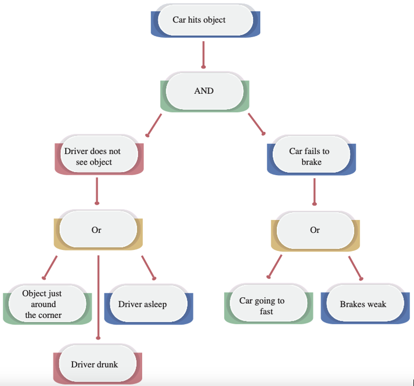
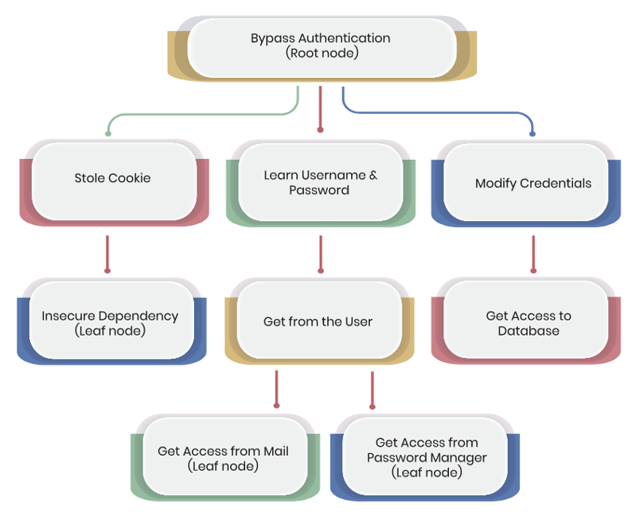
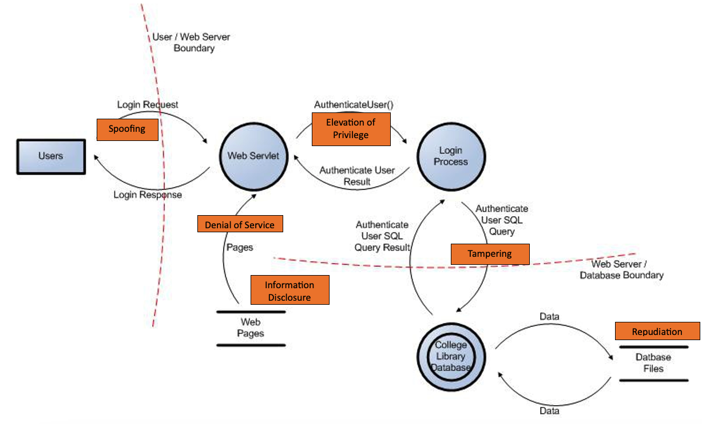
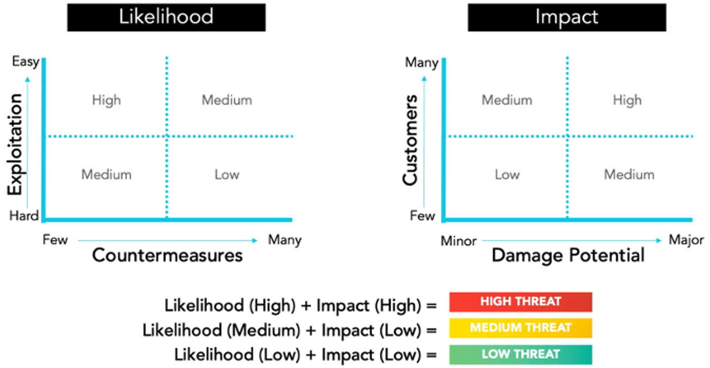
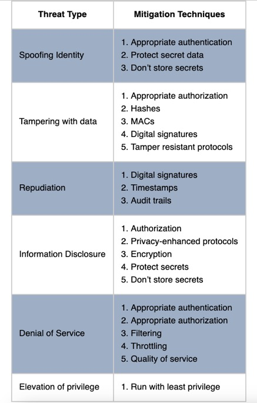

# Threat Modelling

[Summary](#summary)

1. [Step 1 (Scope and Decomposition)](#step-1-scope-and-decomposition)
2. [Step 2 (Draw)](#step-2-draw) 
3. [Step 3 (Analyse Drawings)](#step-3-analyse-drawings)
4. [Step 4 (Mitigate)](#step-4-mitigate)
5. [Step 5 (Document)](#step-5-document)
## Summary
> "Threat modelling is a term applied to the techniques that are used to model and analyse technology systems and services to better understand how that system or service might be attacked or otherwise fail, and the measures or controls needed to manage the risk posed by such attacks or failings. Threat modelling techniques are best applied to inform the design and development phases of a technology system or service life cycle” [NCSC](https://www.ncsc.gov.uk/collection/risk-management/threat-modelling)

- Early and often, threat model all the time

- Results in fewer bugs, smaller attack surface

- About finding problems in the process early so they can be fixed

- Ensure security is fixed in the application as it is being developed.

- Encourages a security mindset in team members such as engineers and developers.

The following example provides a high level, simplification of what threat modelling is.

### Example
> When you leave the house with a child to walk them to school. As you leave you see cars driving past, a dog barking in the street, the sun is beating down with intense heat. So, you hold the child’s hand to cross the road (this is identifying a threat from vehicles), you might apply sunscreen to yourself or the child to prevent sunburn (threat from the heat identified). You might try to avoid the barking dog as it seems aggressive (threat identified).

## Security Feedback Loop
Identifying potential threats ->  evaluate mitigations ->  change the design 

The security feedback loop starts with threat identification. Once threats have been identified we can progress to evaluating potential mitigations and engineering fixes. This is done by perhaps changing the design, removing components, or adding new functionality. The loop then starts again, identifying if threats still exist or if any new threats have now arisen. This is an infinite process loop, with each phase intended to strengthen a given solution.

Threat modelling is part of the design phase, so it should ideally be done before any code is written (early and often).

## Threat modelling process

### Scope -> determine what is the scope of the threat model (whole feature, subsystem etc)

### Draw -> draw a simple diagram with team of whatever it is that is being threat model.

### Analyse -> analyse the individual threats.

### Mitigation -> how to make the threats go away.

### Document -> write down what was discussed and found out during process.

#### Remember
> Threat modelling is not an exact science; different people will come up with different potential threats.
>
> Threat model will never be complete; no such thing as perfect model but the process should help to expand thinking around what potential threats might be.
>
> Iterative process, rinse, and repeat.
>
> Reviewed at proper interval (the interval is determined by the team)

 
## Tools 

**Note:** the following list is not exhaustive and just provides examples of what could be used to threat model.
- Whiteboarding
- MS TM Tool
- Irius risk

 

Four questions approach to threat model (see also - [Threat Modelling Manfesto](https://www.threatmodelingmanifesto.org/))

·      What are we building? (scope/draw)

·      What can go wrong? (Analyse)

·      What are we going to do about it? (Mitigate)

·      Did we do a good job? (document)

 
## Step 1 (Scope and Decomposition)
- Choose Scope (recommended is feature or module level, start small) – focus on most important

- Decompose into use cases to understand how the application is used ([OWASP Foundation - Decomposition](https://owasp.org/www-community/Threat_Modeling_Process#step-1-decompose-the-application))

- Identifying entry points to see where a potential attacker could interact with the application.

- Identifying assets, i.e. items or areas that the attacker would be interested in.

- Identifying trust levels that represent the access rights that the application will grant to external entities. 
### Identify users and actors
For example: users, admins, attackers

### Attack surface analysis
[OWASP - Attack Surface Analysis](https://cheatsheetseries.owasp.org/cheatsheets/Attack_Surface_Analysis_Cheat_Sheet.html)

The concept that some given feature has several interfaces that can be used to send/receive data (which could potentially be attacked), also referred to as **the external attack surface**. Analysing this surface is part of the decomposition and identifying entry points phases of the process.

The **internal attack surface** is likely to be much larger, more vulnerable, and will have users that are able access many parts of the system.

For example: network protocols, web interface, command line interface, system daemon, administration access.

> “Michael Howard at Microsoft and other researchers have developed a method for measuring the Attack Surface of an application, and to track changes to the Attack Surface over time, called the [Relative Attack Surface Quotient (RSQ)](https://www.cs.cmu.edu/~wing/publications/Howard-Wing03.pdf). Using this method you calculate an overall attack surface score for the system, and measure this score as changes are made to the system and to how it is deployed. (…) They calculate the Attack Surface as the sum of all entry and exit points, channels (...) and untrusted data elements. Then they apply a damage potential/effort ratio to these Attack Surface elements to identify high-risk areas.”

## Step 2 (Draw) 
### Draw a DFD (Data flow diagram)

Example: [Threat Modeling Process | DFD](https://owasp.org/www-community/Threat_Modeling_Process#data-flow-diagrams) 

Source: [Threat Modelling Process | OWASP Foundation](https://owasp.org/www-community/Threat_Modeling_Process )

Individual elements of diagram – think about what each element on the DFD does.

An alternative approach is [building an attack tree](https://www.ncsc.gov.uk/collection/risk-management/using-attack-trees-to-understand-cyber-security-risk).

### Examples of an attack tree

#### Example 1

#### Example 2

source - [Using attack trees to understand security risk](https://www.ncsc.gov.uk/collection/risk-management/using-attack-trees-to-understand-cyber-security-risk)

## Step 3 (Analyse Drawings)
### Analyse the DFD

Use STRIDE methodology (various types of threat) when analysing.

·      Spoofing – pretending to be something else.

·      Tampering – Modification of data

·      Repudiation – can something be changed without the system owner knowing about it.

·      Information Disclosure – Leaking information that should be private.

·      Denial of Service – Stopping something from working or responding.

·      Elevation of privilege – Upgrading from user to administrator level access.

### Threat prioritisation

Source: security journey

## Step 4 (Mitigate)

|**Category**|**Compensation Control** |
|--------|---------------------|
|Spoofing|Strong Authentication|
|Tampering|Encryption and hashing|
|Repudiation|Logging and strong authentication|
|Information Disclosure|Encryption|
|Denial of Service|Site/product scalability|
|Elevation of Privilege|Authorization|

### Detailed Threat Mitigation Table

image source: [Threat Modelling Process | OWASP Foundation](https://owasp.org/www-community/Threat_Modeling_Process#stride-threat--mitigation-techniques)

## Step 5 (Document) 
- Add test cases based on discovered threats
- Ensure there are mitigations for all threats

### Did we do a good job?

“Look at the documentation that you've created. Are there no threats? If there are no threats, the answer is no; we did not do a good enough job. Revisit that last question when it comes to the document. There's always at least one threat unless the product feature has no interfaces, and there's no way to communicate with it, and there's no way to update it. In this day and age, there's always some amount of threats that exist for anything.” - security journey

## Useful Links
- [Threat Modelling Manifesto](https://www.threatmodelingmanifesto.org/) 
- [Building a Security Operations Centre - Threat modelling ](https://www.ncsc.gov.uk/collection/building-a-security-operations-centre/onboarding-systems-and-log-sources/threat-modelling)
- [Threat Modelling | NCSC ](https://www.ncsc.gov.uk/collection/risk-management/threat-modelling) 
- [Threat Modelling | OWASP Foundation](https://owasp.org/www-community/Threat_Modeling) 
- [STIX V2.1 and TAXII V2.1 OASIS Standards are published - OASIS Open](https://www.oasis-open.org/2021/06/23/stix-v2-1-and-taxii-v2-1-oasis-standards-are-published/ )
- [MITRE ATT&CK®](https://attack.mitre.org/)
- [Cyber Kill Chain®](https://www.lockheedmartin.com/en-us/capabilities/cyber/cyber-kill-chain.html)
