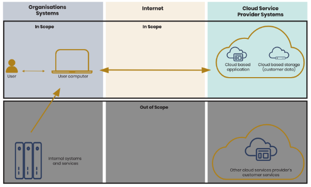
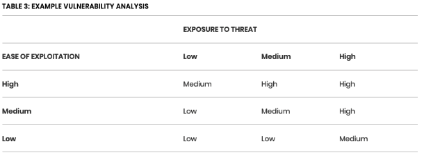
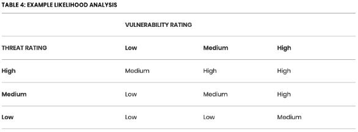
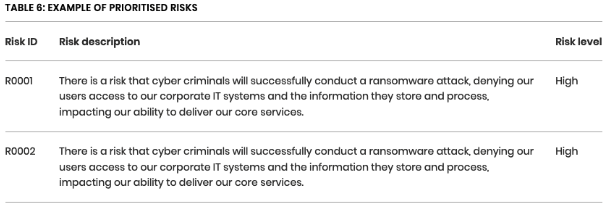
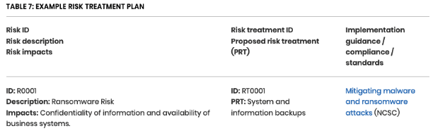

# Threat Management Guidance

A series of checkpoints have been created in a [document here](https://docs.google.com/document/d/10OPig5LFZLqQ1UB68HUYzokrlNh8iw0jeW2JOuNQ9mY/edit?usp=sharing) (Made Tech only) that can be used to gauge progress through the following content whilst carrying out an assessment.

## Threat management
“Many modern threat management systems use the cybersecurity framework established by the National Institute of Standards and Technology (NIST). NIST provides comprehensive guidance to improve information security and cybersecurity risk management for private sector organizations. One of their guides, the NIST Cybersecurity Framework (NIST CF), consists of standards and best practices. Five primary functions make up its core structure. They are to identify, protect, detect, respond and recover.
### Identify
Cybersecurity teams need a thorough understanding of the organization's most important assets and resources. The identify function includes categories, such as asset management, business environment, governance, risk assessment, risk management strategy and supply chain risk management.
### Protect
The protect function covers much of the technical and physical security controls for developing and implementing appropriate safeguards and protecting critical infrastructure. These categories are identity management and access control, awareness and training, data security, information protection processes and procedures, maintenance and protective technology.
### Detect
The detect function implements measures that alert an organization to cyberattacks. Detect categories include anomalies and events, continuous security monitoring and early detection processes.
### Respond
The respond function ensures an appropriate response to cyberattacks and other cybersecurity events. Categories include response planning, communications, analysis, mitigation and improvements.“ https://www.ibm.com/topics/threat-management

## Identify
### Risk Management
1. Establish the context for risk management
- Think about the wider context in which you want to manage cyber risk.
- Think about what your organisation does, and what it cares about. What are the business priorities and objectives?
- Consider what governance structures are in place to manage other types of business risk. How does managing and communicating about cyber risk fit within those structures?
- Ensure that the organisation has adequate policies approved and owned by the board that set out the risk management strategy for the organisation as a whole
2. Define a scope for your risk assessment
- Understand where you need to apply cyber risk management
- Think about the range of technology, systems, services and information that your organisation uses and relies on to achieve its organisational goals and priorities
- Remember to include elements that may be outside of your direct control, but are still part of your wider risk concerns
- Don’t forget to think about how people interact with technology, systems and services. 
3. Understand your assets and assess impact
- Choose a cyber security risk management approach that is right for your organisation
- Think about what approach to cyber security risk management, or mix of approaches, is right for your organisation
- Understand that it is not always necessary to carry out a detailed risk assessment. For example, you could use a baseline such as Cyber Essentials to provide information on the basic controls needed to protect your organisation against most common internet-based attacks.
- Different methods provide different perspectives on risk.
4. Assess the threat
5. Assess your vulnerability
6. Estimate likelihood
- Understand the risks you face and how to manage them
- Use your chosen approach to identify, analyse, assess and prioritise risks and make decisions on how you are going to manage them
- Ensure you are taking into consideration a wide variety in risk information, and seek out information from experts or trusted sources of information
- Remember that if you have chosen to apply controls to manage risk, you should ensure that those controls are proportionate to the risk, usable and do not adversely affect the way the business works.
7. Assess cyber security risk
Communicating and documenting your risks
- Communicate effectively about cyber risks and cyber risk management
- Make sure that you effectively communicate your risk management approach to staff and decision makers
- Ensure that you communicate cyber risk in a way that fits in with how your organisation talks about other types of risk (such as legal or financial risk).
- Make sure you use meaningful language and fully explain any risk labels or scores you use. Using meaningless or poorly communicated labels can lead to misinterpretation and misunderstanding
8. Prioritise risks and propose risk management action
9. Develop a risk treatment plan
- Apply and seek confidence in the controls you have chosen
- Apply the controls you’ve chosen to mitigate risk to your systems and services
- Ensure that you understand what risks remain after you have applied the controls.
- Seek confidence that the package of mitigation measures you put in place have effectively managed the risk you identified, and consider how you will maintain that confidence as your systems are used into the future.
10. Develop an assurance plan
11. Continually iterate and improve
- Continually improve your approach to risk management
- Remember that risk management is an iterative process. Technology changes, as does the business environment and their associated threats and opportunities.
- Regularly review your risks to ensure that the ways you have decided to manage them remain effective and appropriate
- You will also need to review the methods, frameworks and tools you use for risk management to ensure they continue to be effective

- https://www.ncsc.gov.uk/collection/10-steps/risk-management\
- https://www.ncsc.gov.uk/collection/risk-management/a-basic-risk-assessment-and-management-method

### Risk Assessment
1. Define a scope for your risk assessment \
“The scope of assessment should define the boundaries of the existing system you are assessing or the new system that is being built, and your scope should clearly define all the assets that are to be contained within it”
Also consider modelling the system scope with a scoping diagram.

2. Understand your assets and assess impact \
“To help with this you could build a register of assets that could include (for example) the equipment, systems, services, software, information and/or processes that are critical to the successful delivery of your business objectives.”
Once you have identified a list “you should (. . .) assess what the impact would be should those assets be, in some way, compromised. “

“An asset register might look something like the following table where assets and their ownership are clearly identified along with an assessment and rating of impacts.”
| Asset ID | Description             | Impact Assessment                                                           | Impact Rating |
|----------|-------------------------|-----------------------------------------------------------------------------|---------------|
| 0001     | IP designs and property | Loss of designs and property would result in loss of competitive advantage  |  High         | 

3. Assess the threat \
“You should seek out authoritative sources of threat information that can help you understand who might seek to do you and your organisation harm, and why.” \
See also : [Threat Modelling](../learning_paths/threat_modelling.md)

4. Assess your vulnerability \
“Seek out authoritative sources of threat information that can help you understand who might seek to do you and your organisation harm, and why”
“Build an understanding of how threats might attack you and the tactics and techniques they might use against your organisation and the things you are trying to protect. 
(...) Vulnerabilities can exist in people, processes, places and technology and these vulnerabilities may be exploited by threat actors to achieve their aims and objectives.”

“If you are not sure how to document your vulnerability analysis or have no means to rate one vulnerability against another then you could consider making use of a simple 3x3 matrix where threat exposure, exploitability, and the vulnerability itself are scored on a simple Low to High scale.”

5. Estimate likelihood \
“Combine your analysis of threat and vulnerability in some way to arrive at an assessment of how likely it is that a particular threat would make use of a particular tactic or technique to exploit a vulnerability to achieve their aims and objectives, and thereby causing an impact to occur.”
“A simple way to document and analyse likelihood in this context is to use a matrix as shown below where threat and vulnerability ratings, along with likelihood are scored and expressed on a simple Low to High scale.”

6. Assess cyber security risk \
“A cyber security risk is a future event, related to the use of technology systems and services, that might have some form of impact on someone, a system, a business, or an organisation.” 
Communicating and documenting your risks
“When describing risks to decision makers it is important that you communicate to them the certainty or uncertainty surrounding your analysis. Not to do so would communicate to decision makers that you are completely certain that a risk would be realised as you describe.”
7. Prioritise risks and propose risk management action \
“During this step you should review the whole set of risks you came up with during the previous steps and prioritise them for risk management.
 See below a table that illustrates how a prioritised list of risks might be presented.”

8. Develop a risk treatment plan \
“Where you have recommended that cyber security risk be treated using technical or non-technical controls, it is necessary to document and describe those controls, providing as far as possible guidance and information on how they could/should be implemented. 
(. . .) a basic treatment plan may look something like this:“

[NCSC REF](https://www.ncsc.gov.uk/collection/risk-management/a-basic-risk-assessment-and-managemaent-method)

## Protect
Apply appropriate security controls and mitigations (consider following areas)
### “Architecture and configuration
- Understand what you are building and why
- Make systems easy to maintain and update
- Make compromise and disruption difficult
- Safely develop and manage systems
### Vulnerability management
- Keep your systems updated
- Develop a vulnerability management process
- Manage legacy equipment
### Identity and access management
- Develop appropriate identity and access management policies and processes
- Consider multi-factor authentication for all user accounts
- Use MFA and other mitigations for privileged accounts \
  Review user accounts and systems for unnecessary privileges on a regular basis, and ensure privileged accesses are revoked when no longer required.
### Data security
- Protect data in accordance with the risks
- Securely sanitise storage media when no longer needed for its designated purpose
### Logging and monitoring
- Understand your objectives for logging and monitoring
- Make sure your logs are available for analysis when you need them”

[NCSC 10 steps to security](https://www.ncsc.gov.uk/collection/10-steps/)

## Detect
### "Architecture and configuration
- Make it easy to detect and investigate compromises
### Identity and access management
- Employ security monitoring to detect potential malicious behaviour
### Logging and monitoring
- Make sure your logs are available for analysis when you need them
- Protect your logs from tampering so that [it is] hard for an attacker to hide their tracks and you can be confident that they accurately represent what has happened.”

[NCSC Make compromise detection easier](https://www.ncsc.gov.uk/collection/cyber-security-design-principles/making-compromise-detection-easier)

## Respond
### Architecture and configuration
- Reduce the impact of compromise
### Data security
- Backup your data
### Logging and monitoring
- Use your logs to generate useful insights
- Develop an incident response plan
- Stay informed \
Make use of threat intelligence. Sign up to the Cyber Security Information Sharing Partnership CiSP to receive and share threat information and indicators of compromise with industry and government counterparts.

[NCSC 10 steps to security](https://www.ncsc.gov.uk/collection/10-steps/)

